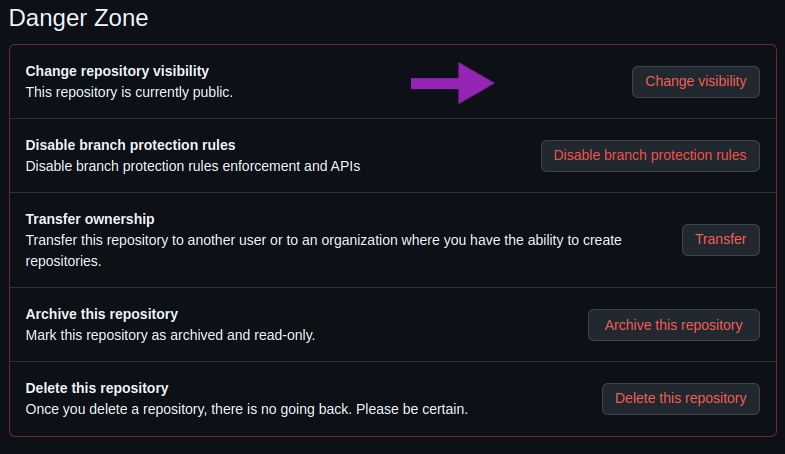
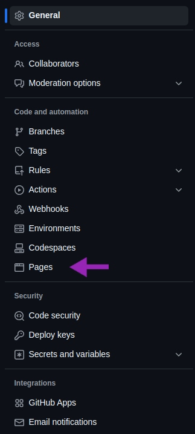
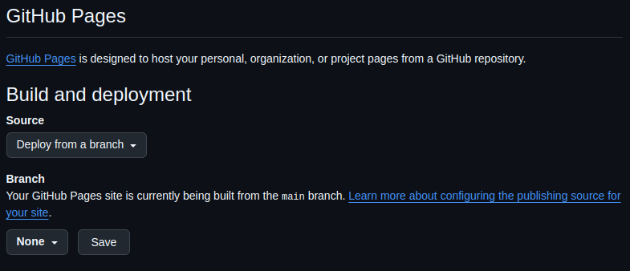
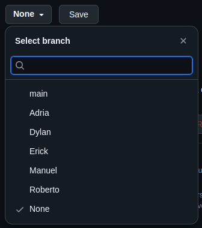

# Explicación del proceso para publicar el proyecto en GitHub Pages:
Para poder publicar tu proyecto en GitHub Pages debemos seguir los siguientes pasos 
1. Ir a la configuración del repositorio, para ello, iremos a **Settings**:

2. Antes de configurar nada deberemos asegurarnos de que nuestro proyecto este en publo y no privado, ya que si esta en privado no podremos añadir nuestro proyecto a Pages. Solo podriamos añadirlo aun estando en privado pagando, para ello, debemos ir a **General** bajar hasta donde ponga **Danger Zone** y dentro de esta modificar el apartado de **Change repository visibility**:

3. Despues debemos ir al apartado de **Pages** para añadir nuestro proyecto:

4. Veremos que donde pone **None** hay un desplegable donde deberemos elegir la rama que queremos añadir a Pages:

5. En nuestro caso queremos que esta sea la main, una vez elegida debemos darle a **Save** para que se guarde:

[Home](./README.md)
